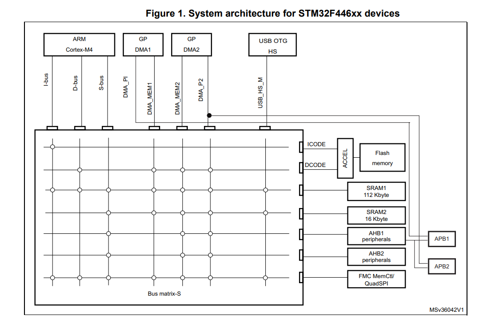

# Memory thingy
- The images below describes bus matrix or how the master talks to the slaves in the memory architecture. You can see that the I-bus only conect to the Flash mem, SRAM1, and FMC MEmCtl/ QuadSPI, so it's can only fetch instruction from those memory for the Arm processor
- Notices how there is a private line from the DMA1 to the APB1 peripheral bus, that's mean that the APB1 peripheral can ride on this private line to the promise land DMA without going to the bus matrix which make it faster

The below image is bus matrix taken from the RF (p. 54)
---

---

# References
- https://www.youtube.com/watch?v=2ROPDlBsb_g