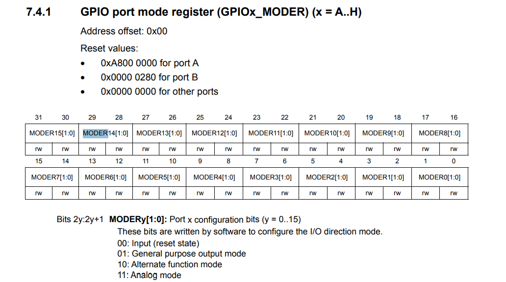
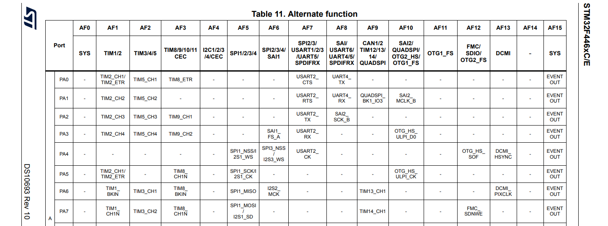
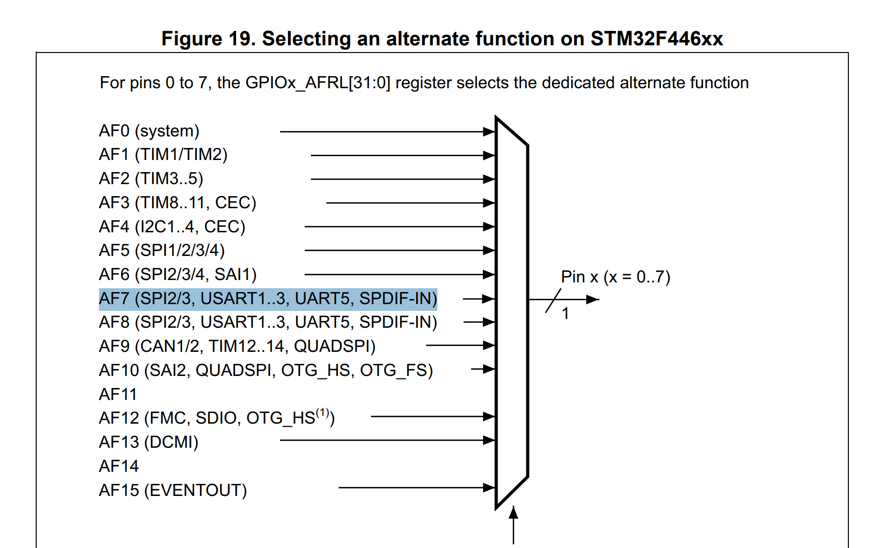
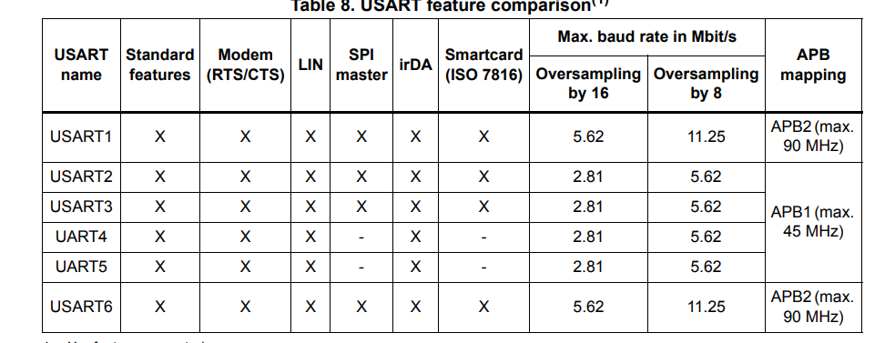
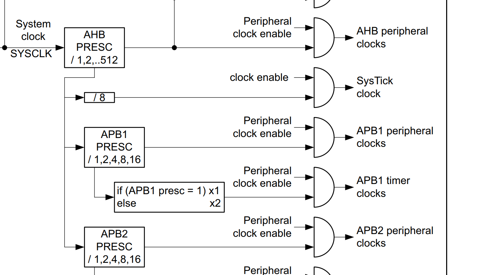
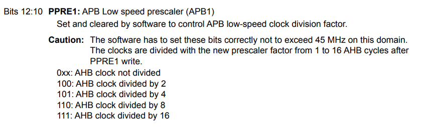

- On the development board F446RE, there are multiple uart
- There's USUART2 that's connect to the ST-LINK2 on PA2 and PA3 according to the schematics and documentations
- According to the manual, we can set the GPIO to different mode:
    - Input floating
    - Input pull-up
    - Input pull-down
    - Analog
    - Output open-drain with pull-up or pull-down capability
    - Output push-pull with pull-up or pull-down capability
    - Alternate function push-pull with pull-up or pull-down capability
    - Alternate function open-drain with pull-up or pull-down capability

 The below images is take from pages of reference manual
---

---

- After switching the mode to the alternate function, we have to enable the specific peripheral function that is mapped to a specific AF (Alternate function) number. For PA2, the alternate function to use USART2 is AF7. More about alternate function can be learn from [this link](https://www.youtube.com/watch?v=1841Gvf0Gpc)

Pages 58 of the datasheet
---

---
Pages 179 of the reference manual
---

---

### It's clocking time
- Brief on how clocks is important: USART need clocks, where do we get it?
- 3 different clock sources can be used to drive the system clock (p117 of RF)
    - HSI
    - HSE
    - Two main PPL clocks
The USART 2 itself, which we are interested is connect to the APB1 (This is under the datasheet p.33)
---

---
- The sysclock is what's drive the APB1 peripheral clocks (Clock tree in the manual). For some real good decision, the arrow go from AHB PRESC, the go APB1 PRESC is just to do hiarchy thingy. To get the clock of APB1, just need to apply the APB1 prescaler to the sysclock. The prescaler is located at bit 10-12 of RCC_CFGR register
---

---
- There are some weird ways to get the prescaler value, basically, 0-3 is 1, and the other is 1 << (value of bit). After, calculating the clock, you can divide the clock by baudrate to feed it to the BBR register for the USART2
---

---