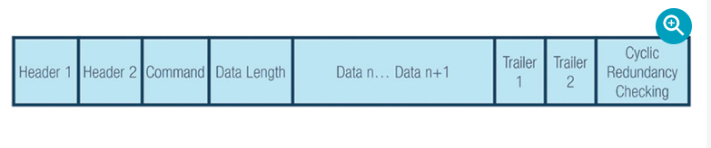

# Theory's thingy
- UART is a hardware communication protocol that uses asynchronous serial communication with configurable speed. Asynchronous means there is no clock signal to synchronize the output bits from the transmitting device going to the receving end

- Has 2 wire/signals
    - Tx
    - Rx

- Baudrate needs to be set the same on both the transmitting and receiving device
- It is the rate at which information is transferred to a communication channel
- Because of asynchrnous nature, instead of generate a clock signal, it generates a bitstream based on its clock signal while the receiver is using its internal clock signal to sample the incoming data.
### Data transmission
- Data is in a form of packet
- A packet is consist of
    - start bit: 1 bit
    - data frame: 5-9 bits
    - parity bits: 0 to 1 bits
    - stop bits: 1 to 2 bits

#### Start bit
- Data transmission line (Tx) is held at high when not transmitting. To start the transfer of data, transmitting pull the transmission line from high to low for 1 clock cycle. When receiving UART, detect the high to low, it begins reading the bits in the data frame at the frequency of the baudrate

#### Data frame
- Contain the actual data
- If no parity bit is used, the data frame can be 9 bits long. In most cases, data is send with least significant bit first

#### Parity
- Parity describes the evenness or oddness of a number. The parity bit is a way for receiving UART to tell if any data has changed during transmission. Bits can be changed by electromagnetic radiation, etc
- AFter receving UART, read the data frame, it counts the number of bits with a value of 1 and checks if the total is an even or odd number. If the parity bit is a 0 (even), the 1 or logic-high bit in the data frame should total to an even number. If the parity bit is a 1 (odd), again, the high should total to an odd number
- Parity just give UART the knowledge that if some frame was changed
- To signal the end of the data packet, the sending UART drives the data transmission line from  a low to a high voltage for 1 to 2 bits duration

### Frame Protocol
- An implement that ensure the security

# Technical details
- On the development board F446RE, there are multiple uart
- There's USUART2 that's connect to the ST-LINK2 on PA2 and PA3 according to the schematics and documentations
- According to the manual, we can set the GPIO to different mode:
    - Input floating
    - Input pull-up
    - Input pull-down
    - Analog
    - Output open-drain with pull-up or pull-down capability
    - Output push-pull with pull-up or pull-down capability
    - Alternate function push-pull with pull-up or pull-down capability
    - Alternate function open-drain with pull-up or pull-down capability

 The below images is take from pages of reference manual
---

---

- After switching the mode to the alternate function, we have to enable the specific peripheral function that is mapped to a specific AF (Alternate function) number. For PA2, the alternate function to use USART2 is AF7. More about alternate function can be learn from [this link](https://www.youtube.com/watch?v=1841Gvf0Gpc)

Pages 58 of the datasheet
---

---
Pages 179 of the reference manual
---

---

### It's clocking time
- Brief on how clocks is important: USART need clocks, where do we get it?
- 3 different clock sources can be used to drive the system clock (p117 of RF)
    - HSI
    - HSE
    - Two main PPL clocks
The USART 2 itself, which we are interested is connect to the APB1 (This is under the datasheet p.33)
---

---
- The sysclock is what's drive the APB1 peripheral clocks (Clock tree in the manual). For some real good decision, the arrow go from AHB PRESC, the go APB1 PRESC is just to do hiarchy thingy. To get the clock of APB1, just need to apply the APB1 prescaler to the sysclock. The prescaler is located at bit 10-12 of RCC_CFGR register
---

---
- There are some weird ways to get the prescaler value, basically, 0-3 is 1, and the other is 1 << (value of bit). After, calculating the clock, you can divide the clock by baudrate to feed it to the BBR register for the USART2
---

---

# Reference
- https://www.analog.com/en/resources/analog-dialogue/articles/uart-a-hardware-communication-protocol.html